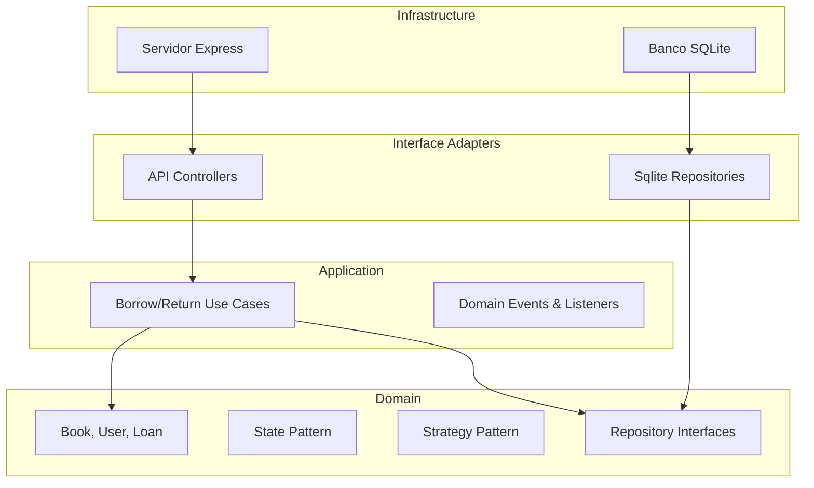
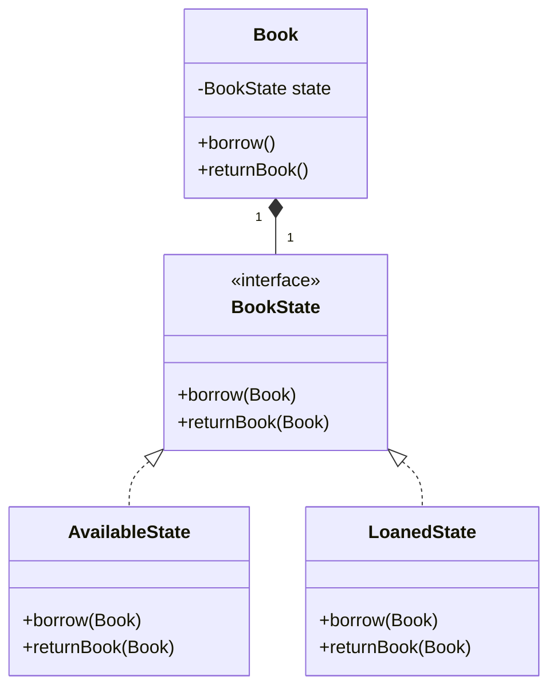

# Documento de Arquitetura - OpenBiblio (Módulo de Empréstimos)

## 1. Introdução
O projeto visa a refatoração arquitetural do módulo de Empréstimos e Devoluções do sistema **OpenBiblio**, um software clássico de gestão de bibliotecas originalmente escrito em PHP estruturado no início dos anos 2000. O problema central do software antigo era ser um "Big Ball of Mud" – uma base de código onde interface de usuário, regras de negócio e consultas SQL estavam fortemente acoplados.

O objetivo é isolar e modernizar essas regras utilizando as melhores práticas atuais, como a Clean Architecture e os Padrões GoF, garantindo alta manutenibilidade e facilidade de testes para a equipe de desenvolvimento. O público-alvo são as bibliotecas comunitárias que necessitam de um sistema estável e de fácil evolução.

## 2. Atributos de Qualidade e Decisões Arquiteturais

### 2A. Atributos de qualidade prioritários
Com base na ISO/IEC 25010:2023, definimos:
1. **Manutenibilidade (Maintainability):** Justificativa: O sistema antigo era extremamente difícil de evoluir. Priorizamos o baixo acoplamento para que as regras de multas e estados de livros possam ser alteradas sem "quebrar" outras partes do sistema.
   - *Decisão:* Adoção da Clean Architecture e padrões GoF (Strategy, State).
2. **Testabilidade (Testability):** Justificativa: Sistemas financeiros (mesmo multas de biblioteca) exigem alta confiança na regra de cálculo.
   - *Decisão:* Inversão de Controle e Injeção de Dependências, permitindo o isolamento da camada de Domínio para testes rápidos.
3. **Interoperabilidade (Interoperability):** Justificativa: O módulo moderno deve conseguir se comunicar com outras possíveis frentes (mobile, totens de autoatendimento).
   - *Decisão:* Construção de uma API REST documentada com OpenAPI.

### 2B. Registro de Decisões Arquiteturais (ADRs)
As decisões de arquitetura e design estão registradas na pasta `docs/adrs/`.

## 3. Estilo Arquitetural

### 3A. Plano macro
O sistema foi desenhado como um **Monolito Modular**. Devido ao tamanho da equipe e ao escopo restrito (apenas o módulo de empréstimos e devoluções), a adoção de microsserviços traria uma complexidade acidental desnecessária (redes, consistência eventual, orquestração). A modularização lógica atende aos atributos de manutenibilidade sem onerar a operação.

### 3B. Plano interno
Adotamos a **Clean Architecture (Robert C. Martin)**.
O código está organizado em camadas concêntricas (regra de dependência de fora para dentro):
- `Domain`: Regras de negócio essenciais (`Book`, `User`, State, Strategy).
- `Application`: Casos de uso (`BorrowBook`, `ReturnBook`) e orquestração.
- `Interface Adapters`: Controladores e Gateways.
- `Infrastructure`: Onde vive o Express e a conexão com o banco SQLite.

## 4. Aplicação dos Princípios SOLID

- **Single Responsibility (SRP):** As classes que implementam o `BookState` (ex: `AvailableState`) possuem uma única razão para mudar: a mudança na regra de transição a partir daquele estado específico.
- **Open-Closed (OCP):** O cálculo de multas no `ReturnBookUseCase` utiliza a interface `FineStrategy`. Podemos criar novas lógicas (ex: `VIPFineStrategy`) sem alterar o caso de uso.
- **Liskov Substitution (LSP):** Qualquer classe de estado de livro pode ser substituída pela outra (já que todas implementam a interface `BookState`) sem causar quebras no comportamento da entidade `Book`.
- **Interface Segregation (ISP):** Os repositórios são separados em interfaces granulares (`BookRepository`, `UserRepository`, `LoanRepository`) ao invés de um genérico `IRepository<T>` inflado.
- **Dependency Inversion (DIP):** O caso de uso `BorrowBookUseCase` depende de abstrações (`BookRepository`), e não da implementação de infraestrutura (`SqliteBookRepository`), permitindo injeção de dependência e testes via mocks.

## 5. Clean Code

Práticas adotadas (verifique os arquivos da camada `src/application` e `src/domain`):
- **Nomes claros:** Nomes baseados no domínio, como `BorrowBookUseCase` e `NotifyNextInLineListener`.
- **Funções pequenas:** Métodos encapsulados e coesos. Por exemplo, a entidade `Loan` possui o método encapsulado `getDaysOverdue()`.
- **Ausência de comentários redundantes:** O código auto-documentado elimina a necessidade de comentários sobre o "que" o código faz; os raros comentários presentes explicam o contexto.
- **Tratamento de erros:** Uso de *exceptions* lançadas imediatamente ao invés de retornos de flags de erro obscuras (ex: lançamento de erro ao tentar emprestar um livro que não está disponível).

## 6. Padrões de Projeto GoF

1. **Padrão State (Comportamental):**
   - **Problema:** Múltiplos condicionais para validar operações em um Livro dependendo de ele estar Disponível, Emprestado ou Atrasado.
   - **Solução:** Interface `BookState` e implementações para cada estado em `src/domain/Book.ts`.
   - **Análise:** Facilitou as validações, mas introduziu uma camada adicional de classes.

2. **Padrão Strategy (Comportamental):**
   - **Problema:** Como calcular multas diferenciadas de acordo com a categoria do usuário.
   - **Solução:** Interface `FineStrategy` e as respectivas classes em `src/domain/FineCalculator.ts`.
   - **Análise:** Mantém o caso de uso limpo. A desvantagem é o pequeno *overhead* da classe `FineCalculator` como Context.

3. **Padrão Observer (Comportamental):**
   - **Problema:** Enviar e-mails e notificar usuários seguintes logo após uma devolução sem acoplar a lógica de e-mail ao caso de uso.
   - **Solução:** Evento `BookReturnedEvent` e listener em `src/application/listeners/NotifyNextInLineListener.ts`.
   - **Análise:** Promove alto desacoplamento e assincronismo lógico.

## 7. Design de API
A interface programática adotada foi o padrão **REST** com payload JSON, visando facilidade de adoção e integração pelas aplicações cliente web/mobile comuns.
- A API não possui versionamento explícito na URL no momento, optando pela estratégia Stripe-like para este escopo reduzido.
- Especificação completa e rotas encontram-se descritas no arquivo `/docs/openapi.yaml`.

## 8. Diagramas e Modelos

### Diagrama de Organização Clean Architecture

### Diagrama de Classes - Padrão State

## 9. Conclusões
A refatoração do módulo de Empréstimos utilizando Clean Architecture e padrões GoF provou-se altamente vantajosa para os atributos de qualidade exigidos. Embora o escopo restrito do módulo tenha gerado a sensação de que alguns padrões foram excessivos (overengineering), a estrutura proposta suportará facilmente a complexidade de futuras iterações sem se degradar novamente em um "Big Ball of Mud". O uso do Node.js/TypeScript combinou flexibilidade com a rigidez de tipos necessária para garantir as interfaces do domínio.

## 10. Referências Bibliográficas
- ISO/IEC 25010:2023. Systems and software engineering — Systems and software Quality Requirements and Evaluation (SQuaRE) — Product quality model.
- Gamma, E., Helm, R., Johnson, R., Vlissides, J. *Design Patterns: Elements of Reusable Object-Oriented Software*. Addison-Wesley, 1994.
- Martin, R. C. *Clean Architecture: A Craftsman's Guide to Software Structure and Design*. Prentice Hall, 2017.
- Nygard, M. *Documenting Architecture Decisions*. Cognitect, 2011.
